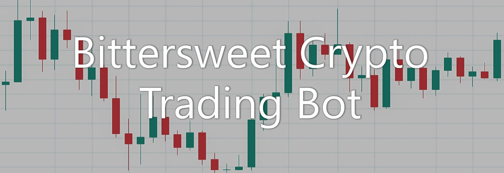
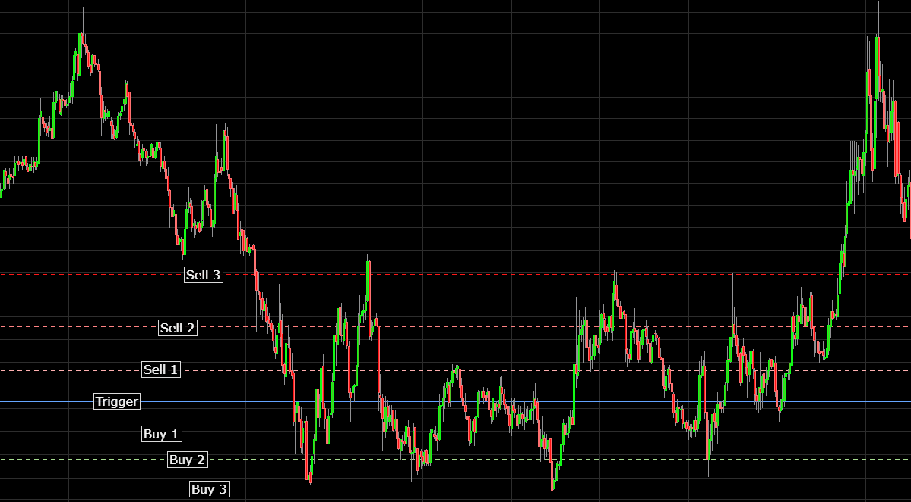
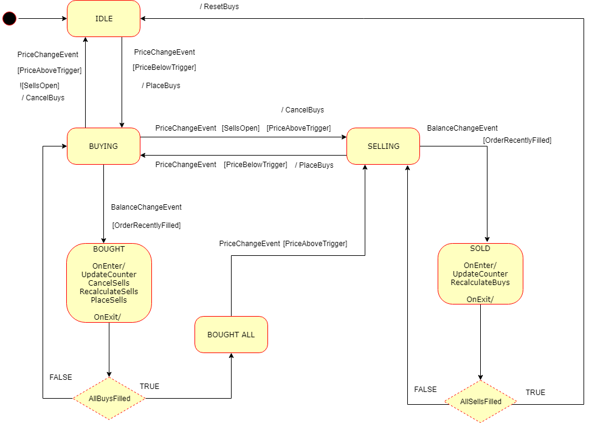

# Bittersweet Crypto Trading Bot
[](https://www.python.org/downloads/)


Bittersweet Crypto Trading Bot is a semi-automatic trading bot for cryptocurrencies. The bot currently:

* Implements the state machine pattern using the [transitions](https://github.com/pytransitions/transitions) library for defining trading strategies.
* Utilizes the [ccxt](https://github.com/ccxt/ccxt) library which supplies a unified API for most crypto exchanges.
* Handles retrying after network or exchange errors.
* Uses an event-driven approach that supports creating strategies using a state machine pattern.
* Has an already implemented strategy for [range trading](#range-trading-strategy).
<br/><br/>



>\**Disclaimer\** I am not responsible for any losses you may incur from using this bot. Always make sure to test your strategies thoroughly on a test account like [BitMex Testnet](https://testnet.bitmex.com/) before using them on your real accounts. Use at your own risk!

## How to use

* First `git clone` the repository.
* Navigate to the folder with `cd bctbot`.
* Install the necessary packages with `pip install -r requirements.txt`.
* Configure your `bot_settings.json` file.
* Change directories into the nested folder where `run_bot.py` is located with `cd bctbot`
* Run the bot with `python run_bot.py --config bot_settings.json`.

### Prerequisites

* Python 3.6 or greater installed.
* An account on one of the cryptocurrency exchanges that are [supported](https://github.com/ccxt/ccxt#supported-cryptocurrency-exchange-markets) in ccxt.
* An API key and secret for that exchange.

## Configuration

The bot uses a JSON settings file which you can specify when running the bot. If you don't specify one it will default to `trading_bot_config.json`.

The following settings are necessary for the bot to make successful trades:

* The **ccxt configuration** for every exchange you want to use. At a minimum you need an `apiKey` and `secret` for each exchange you want to trade on.
You can add other [options](https://github.com/ccxt/ccxt/wiki/Manual#exchange-properties) from the ccxt library as well, such as `enableRateLimit` to prevent the bot from exceeding the API request limit of the exchange.
    ```js
    {
        "kucoin": {
            "ccxt_config": {
                "apiKey": "<YOUR_API_KEY_HERE>",
                "secret": "<YOUR_API_SECRET_HERE>",
                //"password": "<Some exchanges require an additional password>"
                "enableRateLimit": true,
                "verbose": false
            },
            {...}
    ```

* The **markets** you want to trade, which reside under ```"traded_markets"```.

    ```js
    {
        "kucoin": {
            "ccxt_config": {...},
            "traded_markets": {
                "ADB/ETH": {...},
                "DGB/ETH": {...}
            }           
    ```
* The **strategies** you want to use for each market. You can use the same strategy for the same market multiple times by incrementing the number at the end of the strategy name. This can be useful if you want to trade bigger ranges or on different timeframes at the same time.
    ```js
    {
        "kucoin": {
            "ccxt_config": {...},
            "traded_markets": {
                "ADB/ETH": {
                    "range_account_building_1": {...}, 
                    "range_account_building_2": {...}   // Incremented by one
                }
                "DGB/ETH": {...}
            }
    ```

* The **strategy settings** for each individual strategy, which will be different depending on what your selected strategy requires.

    ```js
    {
        "kucoin": {
            "ccxt_config": {...},
            "traded_markets": {
                "ADB/ETH": {
                    "strategies": {
                        "range_account_building_1": {
                            "total_buy_cost": 1.5,
                            "buy_price_1": 0.000005,
                            "buy_price_2": 0.0000048,
                            "buy_price_3": 0.0000046,
                            "buy_amount_percentage_1": 0.34,
                            "buy_amount_percentage_2": 0.33,
                            "buy_amount_percentage_3": 0.33,
                            "sell_price_1": 0.0000055,
                            "sell_price_2": 0.0000057,
                            "sell_price_3": 0.000006,
                            "sell_amount_percentage_1": 0.5,
                            "sell_amount_percentage_2": 0.25,
                            "sell_amount_percentage_3": 0.25
                        },
                        {...}
    ```

# Strategies

The trading strategies are developed using the state machine pattern following the implementation of the [transitions](https://github.com/pytransitions/transitions) library. In order to understand how to create your own trading strategies, you can skip to the [custom strategies](#custom-strategies) section.

## Range trading strategy

This strategy can be used for (preferably volatile) ranging markets. After settings up the prices at which to buy and sell and providing all the required settings, the bot will do the rest.
<br/><br/>

>*After defining a trading range, for instance, after a big bounce, set up your orders around support / resistance levels.*

### How it works

* First the bot will wait for the price to fall below the `Trigger`. 
* Then if it does, it will place all buy orders at once to make sure they all get filled in case of a quick sharp wick down. 
* If at any time the price crosses above the `Trigger`, all remaining buy orders will be canceled to free up funds for other markets you might be trading.
* As soon as the bot detects that a buy order has been filled, it calculates the sell orders and places them on the exchange.
* Whenever a sell order gets filled, the bot will recalculate all buy orders, but will only place them if the price has gone below the `Trigger` again.
* This strategy will make sure it 'refills' buy orders accordingly whenever a sell order gets filled. If for example you bought 1000 coins at `buy_order_1` and the prices moves up and `sell_order_1`, which consists of 50% of your available coins, is filled, then if the price returns below the `Trigger` and the buy orders are placed again, it will only 'fill up' the remaining amount in the recalculated `buy_order_1`, so 500 coins in this case. This allows the strategy to generate profits even if the outer orders are never reached.
* If all sell orders get filled, the bot goes back to the initial state of the strategy.

### \***Warning\***

**If the price drops below your lowest buy order there's always a chance it will keep diving. That's where you need to manually manage your risk, so if that happens you should be prepared to handle that situation. Here are a few suggestions:**
* DCA (Dollar Cost Average) and sell at (near) break-even. This means buying more coins even lower so that your average buy-in price becomes lower. This increases your chance of getting out with minimal losses but you need a lot of capital to do this and if there's no bounce you're in a pretty bad position.
* Sell it all and take the loss. This is probably the safest option, but you will take a greater initial loss.
* Hodl. Wait it out and hope for the price to eventually return to your break-even point or one of your sell prices.

### Required settings

 For this strategy to work, you need to supply the following settings in your JSON file:

* Prices at which to buy and sell, `buy_price_<number>` and `sell_price_<number>`. You can have as many additional buy and sell prices as you want, just make sure to increment the number at the end:
```js
"strategies": {
    "range_account_building_1": {
        "buy_price_1": 0.000005,
        "buy_price_2": 0.0000048,
        "buy_price_3": 0.0000046,
        "sell_price_1": 0.0000055,
        "sell_price_2": 0.0000057,
        "sell_price_3": 0.000006,
    }
```

* Total amount of base currency (ETH in the case of ADB/ETH) you want to trade with:

```js
"strategies": {
    "range_account_building_1": {
        "total_buy_cost": 1.5,
    }
```

* Percentages to calculate the amount of coins to buy from the `total_buy_cost`. In this example `buy_amount_percentage_1` indicates that it will use 34% of the 1.5 total assigned ETH to buy ADB. So an order to buy 102,000 ADB coins at a price of 0.000005 ADB/ETH will be placed.

```js
"strategies": {
    "range_account_building_1": {
        "buy_amount_percentage_1": 0.34,
        "buy_amount_percentage_2": 0.33,
        "buy_amount_percentage_3": 0.33,
        {...}
    }
```

* Percentages to calculate the amount of coins to sell from the amount of coins you currently have:
```js
"strategies": {
    "range_account_building_1": {
        {...},
        "sell_amount_percentage_1": 0.5,
        "sell_amount_percentage_2": 0.25,
        "sell_amount_percentage_3": 0.25
    }
```

## Custom strategies

The bot is structured in such a way that you can easily add your own custom strategy. If you have a brilliant idea for a new trading strategy, it can be beneficial to visualize it in a state diagram first. This will help solidify your strategy because it forces you to think about the strategy as a closed system, which in turn makes it easier to spot inconsistencies in your strategy because your program needs to be in a defined state at all times. First we'll look at the [state diagram](#state-diagram) and then I'll show you [how to implement](#how-to-implement) it.

### State diagram
To give you an idea of how to draw up a state diagram for trading strategies, you can study the state diagram I used for implementing the range trading strategy:
<br/><br/>

>*State diagram that contains all possible states, transitions, events, conditions and actions for the range trading strategy.*


* States, represented by boxes, refer to the state a strategy is in and dictates what transitions are available.
* Transitions, indicated by arrows, are invoked by events and will move the state of the strategy to another state.
* Events, written next to or above transition arrows, will trigger transitions.
* Conditions, written between brackets, are checked before transitioning to another state and will halt the transition if any of them return false.
* Actions, preceeded by a slash, are methods you want to call whenever a transition or state change occurs.

### How to implement

After you have created your state diagram, you can start writing your code as follows:

#### Strategy class

All the logic of your newly created strategy will reside within a class which inherits from `Strategy` and sits in the `strategies.py` file.

```py
class RangeAccountBuilding(Strategy):
``` 

#### States

Add a list called `states` as a class attribute to your custom strategy class which contains all the possible states your strategy can be in.

```js
states = ["idle", "buying", "bought", "bought_all",
          "selling", "sold", "sold_all"]
```

#### Transitions

Add a list called `transitions` as a class attribute which contains transition objects that include at the very least a `trigger`, `source` and `dest` field. Optionally, you can include `conditions`, `unless`, `after` and `before` fields. For more detailed information, check out the transitions [docs](https://github.com/pytransitions/transitions#transitions).

```js
transitions = [
    {
    "trigger": "price_change_event", 
    "source": "buying", 
    "dest": "idle",
    "conditions": ["price_above_buy_trigger"], 
    "unless": ["any_sell_order_open"], 
    "before": ["cancel_buy_orders"]
    },
    {...}
]
```

For the complete resolution order check out the transitions [docs](https://github.com/pytransitions/transitions#callback-resolution-and-execution-order).

#### Events

There are currently two events which you can use to trigger transitions:
 * `price_change_event` fires when price of the current market has changed relative to the last polled price.
 * `balance_change_event` fires when the balance of the current market has changed compared to the last polled balance.


#### Conditions
You can add methods to your strategy class representing conditions that must be met in order for the transition to succeed. You can set those in the `conditions` field of the transaction object. Alternatively you can use the `unless` field that behaves exactly like `conditions`, but inverted, for example:
```py
# conditions
    def price_above_trigger(self):
        return self.market.last_price > self.buy_trigger

# unless
def any_sell_order_open(self):
    for order in self.orders.values():
        if order.side == "sell" and order.status == "open":
            return True
    return False
```

#### Actions
For each strategy there are probably several custom methods you want to call to calculate various things. You have to decide if you want to execute those before/after transitions or whenever you enter/exit a state.
##### Transitions
Actions to execute before or after a transition, for example:
* `before`
```py
def cancel_buy_orders(self):
    for order in self.orders.values():
        if order.side == "buy":
            order.cancel_order()
```
* `after`

##### State
If you want to have an action happen when you enter a certain state, you can specify either `on_enter_<state>` or `on_exit_<state>`, for example:
* `on_enter`
When the state `sold` is entered, execute the following code:
```py
def on_enter_sold(self):
    self.recalculate_buy_orders()
    if self.all_sell_orders_filled():
        self.to_idle()
    else:
        self.to_selling(
```
* `on_exit`

### Adding the strategy
When you're done coding your strategy, you just need to add it to the `set_strategy()` method of the base `Strategy` class:
```py
@staticmethod
def set_strategy(strategy_name, market, strategy_settings):
    if strategy_name.startswith("range_account_building"):
        return RangeAccountBuilding(market, strategy_settings)
    elif strategy_name.startswith("your_awesome_strategy"):
        return YourAwesomeStrategy(market, strategy_settings)
```
And then use it in your `settings.json` file:
```js
{
    "kucoin": {
        "ccxt_config": {...},
        "traded_markets": {
            "ADB/ETH": {
                "your_awesome_strategy": {...} 
```
## Additional notes

* If you're running the bot for the first time, make sure you have a `/log` directory in the same folder where `run_bot.py` is located.
* Keep in mind that your `apiKey` and `secret` are exposed in your logs and settings files, so only use the bot on your own private server. This will be addressed in future versions, so tread carefully for now.

## Built With

* [ccxt](http://www.dropwizard.io/1.0.2/docs/) - A JavaScript / Python / PHP cryptocurrency trading API with support for more than 130 bitcoin/altcoin exchanges.
* [transitions](https://github.com/pytransitions/transitions) - A lightweight, object-oriented finite state machine implementation in Python.
